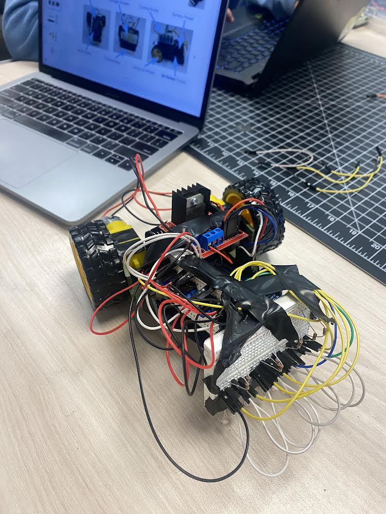
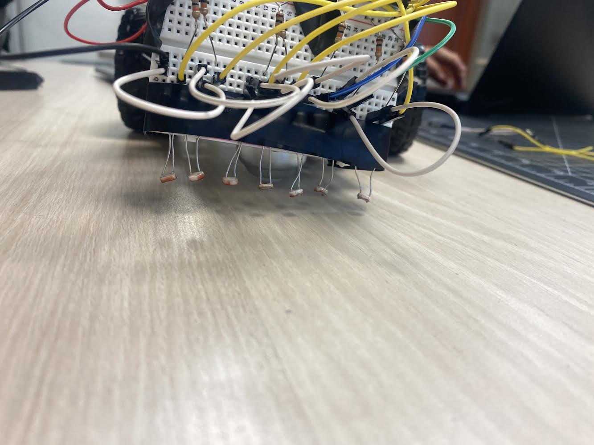

# ECE 5 Arduino Robot
---
Team Names: 

- Jorge Anicacio
- Bella Cortez
- Lucero Felix Salazar
- 

# Inital Robot Protype

The first photo is a clearer and full body image of the protype where you can see all of the breadboards that were temporially taped on to the body. The second photo shows sa better view of the photoresitors where we were testing the height. However, in the photo is looks slanted but it is stright and evenly touching the ground.

# Poster

# Compettition Scores

# Competition Video

# Reflections 
